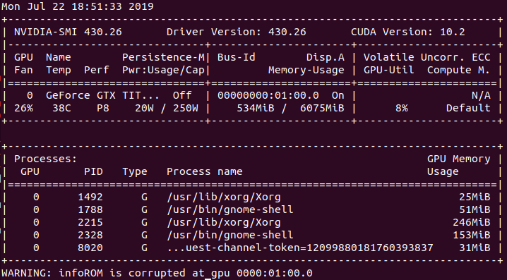

# Install Docker and Nvidia-Docker2 for ML

## Test Env.
* Ubuntu 18.04

## Remove _nouveau_ Driver
> 이 부분을 생략하고 설치해도 됨. 오히려 이 부분을 수행시 18.04에서 youtube등의 수행에 문제가 발생한다는 지적이 있음.
* _nouveau_ 드라이버가 자체적으로 설치되어 있음.
* 해당 드라이버는 ML을 위한 gpu연산등을 지원하지 않으므로 제거하고 nvidia 드라이버를 설치해야함.
```
lsmod | grep nouveau
```
* 위의 명령어 실행으로 _nouveau_ 의 설치 유무 확인하고 설치된 경우 실행을 막기 위해 다음의 절차를 수행함.
  * _nouveau_ 드라이버 실행 중지를 위해 `blacklist-nouveau.conf`파일 생성..
  ```
  sudo vi /etc/modprobe.d/blacklist-nouveau.conf
  ```
  * 위의 명령어 수행후 다음과 같이 파일 내용 기재하고 재부팅하여 _nouveau_ 제거 완료.
  ```
  blacklist nouveau
  options nouveau modset=0
  ```
  * 아래의 명령어 수행 후 재부팅함.
  ```
  sudo update-initramfs -u
  sudo reboot
  ```

## CUDA 9.2 이상의 버전과 호환 가능한 nvidia 드라이버 설치

```
sudo add-apt-repository ppa:graphics-drivers/ppa
sudo apt update
sudo ubuntu-drivers autoinstall
sudo reboot
```

* 위의 명령어 수행후 `nvidia-smi`로 확인

* 현재 430.26 버전의 드라이버와 CUDA 10.2가 설치됨(2019.07.22당시)

## Docker설치

nvidia-docker2설치를 위해 기존 설치된 docker제거.
```
sudo apt-get remove docker docker-engine docker.io
```

nvidia-docker2 설치를 위해 `docker-ce` 설치.
```
sudo apt-get update

sudo apt-get install \
    apt-transport-https \
    ca-certificates \
    curl \
    gnupg-agent \
    software-properties-common

curl -fsSL https://download.docker.com/linux/ubuntu/gpg | sudo apt-key add -

sudo add-apt-repository \
   "deb [arch=amd64] https://download.docker.com/linux/ubuntu \
   $(lsb_release -cs) \
   stable"

sudo apt-get update && sudo apt-cache search docker-ce

sudo apt-get install docker-ce

sudo usermod -aG docker $USER
```

* `$USER`는 현재 사용중인 계정 명으로 바꾸어야 함.

## nvidia-docker2 설치

ubuntu계열의 nvidia-docker2 설치

```
# Add the package repositories
distribution=$(. /etc/os-release;echo $ID$VERSION_ID)
curl -s -L https://nvidia.github.io/nvidia-docker/gpgkey | sudo apt-key add -
curl -s -L https://nvidia.github.io/nvidia-docker/$distribution/nvidia-docker.list | sudo tee /etc/apt/sources.list.d/nvidia-docker.list

sudo apt-get update && sudo apt-get install -y nvidia-container-toolkit
sudo systemctl restart docker
```

## docker image 를 받아와서 테스트.

docker hub의 NVIDIA의 이미지 버전들에서 적절한 이미지를 pull.

* [NVIDIA의 Docker Container Images](https://hub.docker.com/r/nvidia/cuda/tags)

다음의 명령어는 CUDA 10.1과 cuDNN 7 버전의 Container에 해당하는 image를 받은 것임.

```
docker pull nvidia/cuda:10.1-cudnn7-devel-ubuntu18.04

docker run -ti --gpus all --rm nvidia/cuda:10.1-cudnn7-devel-ubuntu18.04 bash
```
> # Start a GPU enabled container on two GPUs
$ docker run --gpus 2 nvidia/cuda:9.0-base nvidia-smi

# Starting a GPU enabled container on specific GPUs
$ docker run --gpus device=1,2 nvidia/cuda:9.0-base nvidia-smi
$ docker run --gpus device=UUID-ABCDEF,1 nvidia/cuda:9.0-base nvidia-smi

# Specifying a capability (graphics, compute, ...) for my container
# Note this is rarely if ever used this way
$ docker run --gpus all,capabilities=utility nvidia/cuda:9.0-base nvidia-smi

이후 `nvidia-smi`를 수행해서 최종 확인.

## References
* [docker documents](https://docs.docker.com/install/linux/docker-ce/ubuntu/)
* [nvida-docker](https://github.com/NVIDIA/nvidia-docker)
* [유리상자 속 이야기 : RedHat 에 Tensorflow GPU 모드로 설치하기](https://crystalcube.co.kr/193)


