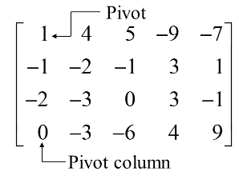
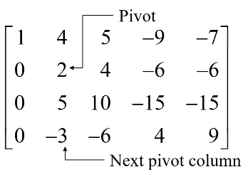
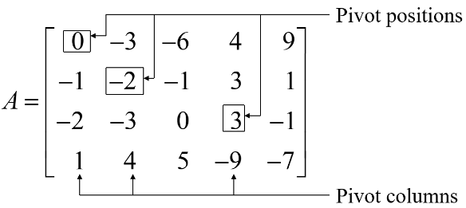
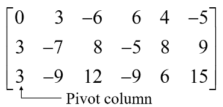
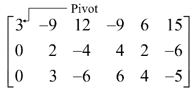
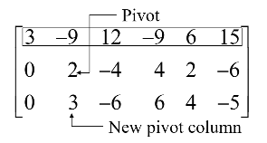
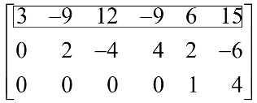
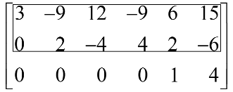

# Linear Equations in Linear Algebra

# 1.2 Row Reduction and Echelon Forms

 A **nonzero row or column** in a matrix means a row or column that contains at least one nonzero entry

 A **leading entry** of a row refers to the leftmost nonzero entry in a nonzero row.

## Echelon Form

 A rectangular matrix is in **echelon form** (or **row echelon form, REF**) 
if it has the following three properties:

* All nonzero rows are above any rows of all zeros.
* Each **leading entry** of a row is in a column to the right of the **leading entry** of the row above it.
* All entries in a column below a leading entry are zeros.

 If a matrix in echelon form satisfies the following additional conditions, 
then it is in **reduced echelon form** (or **reduced row echelon form, RREF**):

* The leading entry in each nonzero row is **1**.
* **Each leading 1 is the only nonzero entry in its column**.

 An **echelon matrix** (respectively, **reduced echelon matrix**) 
is one that is in **echelon form** (respectively, **reduced echelon form**.)

 Any nonzero matrix may be **row reduced** (i.e., *transformed by elementary row operations*) 
into *more than one matrix in* **echelon form**, 
using different sequences of row operations. 
However, the **reduced echelon form** one obtains from a matrix is **unique**.  

## Theorem 1: Uniqueness of the Reduced Echelon Form

Each matrix is *row equivalent* to one and **only one reduced echelon matrix**.

## Pivot Position

 If a matrix $$A$$ is row equivalent to an echelon matrix $$U$$, 
we call $$U$$ **an echelon form** (or row echelon form) of $$A$$; 
if $$U$$ is in reduced echelon form, we call i$$U$$ **the reduced echelon form of $$A$$**.

 A `pivot position` in a matrix $$A$$ is a location in $$A$$ 
that corresponds to a **leading 1 in the reduced echelon form of $$A$$**. 

 A `pivot column` is a column of $$A$$ that contains a pivot position.

## Example 2

 Row reduce the matrix $$A$$ below to echelon form, and locate the `pivot column`s of $$A$$.

$$
A=
\begin{bmatrix}
0 & -3 & -6 & 4 & 9 \\
-1 & -2 & -1 & 3 & 1 \\
-2 & -3 & 0 & 3 & -1 \\
1 & 4 & 5 & -9 & -7
\end{bmatrix}
$$

### Solution of Example 2

 The **top of the leftmost nonzero column** is the **first** `pivot position`. 
A nonzero entry, or `pivot`, must be placed in this position.

Create zeros below the pivot, 1, 
by adding multiples of the first row to the rows below, 
and obtain the next matrix.

Add $$\frac{-5}{2}$$ times row 2 to row 3, and 
add $$\frac{3}{2}$$ times row 2 to row 4.

$$
\begin{bmatrix}
1 & 4 & 5 & -9 & -7 \\
0 & 2 & 4 & -6 & -6 \\
0 & 0 & 0 & 0 & 0 \\
0 &0 &0 & -5 & 0 
\end{bmatrix}
$$

There is no way to create a leading entry in column 3. 
However, if we interchange rows 3 and 4, 
we can produce a leading entry in column 4.

The matrix is in **echelon form** and 
thus reveals that columns 1, 2, and 4 of $$A$$ are `pivot columns`.

The pivots in the example are 1, 2 and -5.

## Row Reduction Algorithm

## Example 3: 

Apply elementary row operations 
to transform the following matrix 
first into **echelon form** and 
then into **reduced echelon form**:

$$
\begin{bmatrix}
0 & 3 & -6 & 6 & 4 & -5 \\
3 & -7 & 8 & -5 & 8 & 9 \\
3 & -9 & 12 & -9 & 6 & 15
\end{bmatrix}
$$

### Solution of Example 3

#### Step 1

Begin with the leftmost nonzero column.
This is a pivot column. The pivot position is at the
top.

#### Step 2

Select a nonzero entry in the pivot column
as a pivot. If necessary, interchange rows to move
this entry into the pivot position.

Interchange rows 1 and 3. (We could have
interchanged rows 1 and 2 instead)

#### Step 3: 

Use row replacement operations to create zeros in all positions below the pivot.

We could have divided the top row by the pivot, 3, but with two 3s in column 1, 
it is just as easy to add -1 times row 1 to row 2.

#### Step 4: 

Cover (or ignore) the row containing the pivot position and cover all rows, if any, above it. 
Apply steps 1~3 to the submatrix that remains. 
Repeat the process until there are no more nonzero rows to modify.

With row 1 covered, step 1 shows that column 2 is the next pivot column; 
for step 2, select as a pivot the "top" entry in that column.

For step 3, we could insert an optional step of dividing the "top" row of the submatrix by the pivot, 2. 
Instead, we add $$\frac{2}{3}$$ times the "top" row to the row below.

This produces the following matrix.

When we cover the row containing the second pivot
position for step 4, we are left with a new submatrix
that has only one row.

Steps 1~3 require no work for this submatrix, and
we have reached an echelon form of the full matrix.
We perform one more step to obtain the reduced
echelon form.

## Step 5:

Beginning with the rightmost pivot and working upward and to the left, 
create zeros above each pivot. 
If a pivot is not 1, make it 1 by a scaling operation.

The rightmost pivot is in row 3. 
Create zeros above it, adding suitable multiples of row 3 to rows 2 and 1.

The next pivot is in row 2. Scale this row, dividing
by the pivot.

Create a zero in column 2 by adding 9 times row 2
to row 1.

Finally, scale row 1, dividing by the pivot, 3.

This is the reduced echelon form of the original matrix.

The combination of steps 1~4 is called the **forward phase** of the row reduction algorithm.
Step 5, which produces the unique reduced echelon form, is called the **backward phase**.

## Solutions of Linear Systems 

The row reduction algorithm leads to an explicit
description of the solution set of a linear system when
the algorithm is applied to the augmented matrix of the
system.

Suppose, for example, that the augmented matrix of a
linear system has been changed into the equivalent
reduced echelon form.

$$
\begin{bmatrix}
1 & 0 & -5 & 1 \\
0 & 1 & 1 & 4 \\
0 &0 &0 &0 
\end{bmatrix}
$$

There are three variables because the augmented
matrix has four columns. The associated system of
equations is

$$
\begin{align*}
x_1 - 5x_3 & = 1 \\
x_2 +x_3 &= 4 \\
0 &= 0
\end{align*} \tag{4}
$$

The variables $$x_1$$ and $$x_2$$ corresponding to pivot columns in the matrix 
are called `basic variables`.

The other variable, $$x_3$$ is called a `free variable`.

Whenever a system is consistent, as in (4), the
solution set can be described explicitly by solving
the reduced system of equations for the basic
variables in terms of the free variables.

This operation is possible because the reduced
echelon form places each basic variable in one
and only one equation.

In (4), solve the first and second equations for $$x_1$$ and the second for $$x_2$$ 
(Ignore the third equation; it offers no restriction on the variables.)

$$
\begin{align*}
x_1 &= 1 + 5x_3 \\
x_2 &= 4-x_3  \\
x_3 & \text{ is free}
\end{align*} \tag{5}
$$

The statement $$x_3 & \text{ is free}$$ means that you are free to choose any value for $$x_3$$.
Once that is done, the formulas in (5) determine the values for $$x_1$$ and $$x_2$$.
For instance, when $$x_3=0$$, the solution is (1,4,0); 
when $$x_3=1$$, the solution is (6,3,1).

Each different choice of $$x_3$$ determines a (different) solution of the system, 
and every solution of the system is determined by a choice of $$x_3$$.

## Parametric Descriptions of Solution Sets

The descriptions in (5) and (7) are parametric
descriptions of solutions sets in which the free
variables act as parameters.

Solving a system amounts to finding a parametric
description of the solution set or determining that
the solution set is empty.

Whenever a system is consistent and has free
variables, the solution set has many parametric
descriptions.

For instance, in system (4), we may add 5 times
equation 2 to equation 1 and obtain the following
equivalent system

$$
\begin{align*}
x_1 + 5x_2 & = 21 \\
x_2 +x_3 &= 4 \\
\end{align*} 
$$

We could treat $$x_2$$ as a parameter and solve for $$x_1$$ and $$x_3$$ 
in terms of $$x_2$$, and we would have an accurate description of the solution set.

Whenever a system is inconsistent, the solution set is
empty, even when the system has free variables. In this
case, the solution set has no parametric representation.

## Theorem 2 : Existence and Uniqueness Theorem

A linear system is consistent if and only if the rightmost
column of the augmented matrix is not a pivot column -- i.e.,
if and only if an echelon form of the augmented matrix has
no row of the form

$$
[0 & \cdots & 0] \text{ with } b \text{ nonzero.}
$$

If a linear system is consistent, then the solution set contains
either (i) a unique solution, when there are no free variables,
or (ii) infinitely many solutions, when there is at least on free
variable.

## Using Row Reduction to Solve a Linear System

1. Write the augmented matrix of the system.
2. Use the row reduction algorithm to obtain an equivalent augmented matrix in echelon form. Decide whether the system is consistent. If there is no solution, stop; otherwise, go to the next step.
3. Continue row reduction to obtain the reduced echelon form.
4. Write the system of equations corresponding to the matrix obtained in step 3. 
