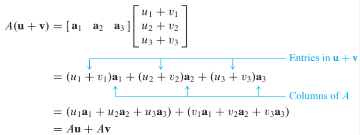

# Linear Equations in Linear Algebra

# 1.4 The Matrix Equation $$A\bf{x}$$

## Definition

 If $$A$$ is an $$m \tiems n$$ matrix, with columns $$\bf{a}_1, \cdots, \bf{a}_n$$, 
and if $$\bf{x}$$ is in $$\mathbb{i}^n$$, 
then the product of $$A$$ and $$\bf{x}$$, denoted by $$A\bf{x}$$
** is the linear combination of the columns of $$A$$ using the corresponding entries in $$\bf{x}$$
as weights; that is,

$$
A\bf{x} =
\begin{bmatrix}
\bf{a}_1 & \cdots & \bf{a}_n
\end{bmatrix}
\begin{bmatrix}
x_1 \\ 
\vdots \\
x_n
\end{bmatrix}
=
x_1\bf{a}_1 +x_2\bf{a}_2 + \cdots +  x_n\bf{a}_n
$$

Note that $$A\bf{x}$$ is defined only if the number of columns
of $$A$$ equals the number of entries in $$\bf{x}$$.

## Theorem 4

Let $$A$$ be an $$m \tiems n$$ matrix. Then the following statements are logically equivalent. 
That is, for a particular $$A$$, 
either they are all true statements or they are all false.

a. For each $$\bf{b}$$, in $$mathbb{R}^m$$ the equation $$A\bf{x}$$ has a solution.
b. Each $$\bf{b}$$ in $$mathbb{R}^m$$ is a linear combination of the columns of $$A$$.
c. The columns of $$A$$ span $$mathbb{R}^m$$
d. $$A$$ has a pivot position in every row.

## Example 4

### solution of Example 4

## Row-Vector Rule for Computing $$A\bf{x}$$

Likewise, the third entry in $$A\bf{x}$$ can be calculated

from the third row of $$A$$ and the entries in $$\bf{x}$$.

If the product $$A\bf{x}$$ is defined, then the $$i$$-th entry in $$A\bf{x}$$
the sum of the products of corresponding entries
from row $$i$$ of $$A$$ and from the vector $$\bf{x}.

The matrix with 1’s on the diagonal and 0’s
elsewhere is called an `identity matrix` and is
denoted by $$I$$.

For example, $$\begin{bmatrix} 1 & 0 & 0 \\ 0 & 1 & 0 \\ 0 & 0 & 1 \end{bmatrix}$$ is an identity matrix.

## Properties of the Matrix-Vector Product $$A\bf{x}$$

## Theorem 5

If $$A$$ is an $$m \times n$$ matrix, $$\bf{u}$$ and $$\bf{v}$$ are vectors in
$$mathbb{R}^n$$, and $$c$$ is a scalar, then

a. $$A(\bf{u} +\bf{v}) = A\bf{u} +A\bf{v} $$
b. A(c\bf{u}) = c(A\bf{u})

### Proof of Theorem 5

For simplicity, take $$n =3$$, $$A = \begin{bmatrix} a_1 & a_2 & a_3 \end{bmatrix} $$,
and $$\bf{u}$$ and $$\bf{v}$$ in $$mathbb{R}^n$$.

For $$i=1,2,3$$, let $$u_i$$ and $$v_i$$ be the $$i$$-th entries in $$\bf{u}$$ and $$\bf{v}$$, respectively.

To prove statement (a), compute $$A(\bf{u}+\bf{v})$$ 
as a linear combination of the columns of $$A$$ using the entries in
$$\bf{u} + \bf{v}$$ as weights.

To prove statement (b), compute $$A(c\bf{u})$$ as a linear combination of the columns of $$A$$
using the entries in $$c\bf{u}$$ as weights.

$$\blacksquare$$
