# Chapter 1. Linear Equations in Linear Algebra

# 1.9 The Matrix of a Linear Transformation

## The Matrix of a Linear Transformation

---

## Theorem 10: 

Let $$T: \mathbb{R}^n \rightarrow \mathbb{R}^m$$ be a linear transformation. Then there exists a unique matrix $$A$$ such that $$$$
T(\textbf{x})= A\textbf{x} \text{ for all} \textbf{x} \in \mathbb{R}^n$$$$

In fact, $$A$$ is the $$m \times n$$ matrix whose $$j$$th column is the vector $$T(\textbf{e}_j)$$, where $$\textbf{e}_j$$ is the $$j$$th column of the identity matrix in $$\mathbb{R}^n$$ $$$$
A=\begin{bmatrix}T(\textbf{e}_1)& \cdots &T(\textbf{e}_n)\end{bmatrix} \tag{3}
$$$$

#### Proof:

Write $$\textbf{x}= I_n\textbf{x}
=\begin{bmatrix}\textbf{e}_1& \cdots &\textbf{e}_n\end{bmatrix}\textbf{x}
=x_1\textbf{e}_1 +\cdots+x_2\textbf{e}_n$$, and 

use the linearity of $$T$$ to compute

$$$$
\begin{align}
T(\textbf{x}) &= T(x_1\textbf{e}_1 +\cdots+x_2\textbf{e}_n)\\
&= x_1T(\textbf{e}_1) + \cdots + x_nT(\textbf{e}_n)\\
&= \begin{bmatrix}T(\textbf{e}_1)& \cdots &T(\textbf{e}_n)\end{bmatrix}
\begin{bmatrix}x_1 \\ \vdots \\x_n\end{bmatrix} \\
&= A\textbf{x}
\end{align}
$$$$

> 유일성에 대한 증명은 생략(연습문제) $$\blacksquare$$

---

* The matrix A in (3) is called **the standard matrix for the linear transformation $$T$$**.
* We know now that **every linear transformation** from $$\mathbb{R}^n$$ to $$\mathbb{R}^m$$ can be viewed as a **matrix transformation**, and vice versa. 
  * The term **linear transformation** focuses on a property of a mapping, 
  * while **matrix transformation** describes how such a mapping is implemented.

## Example 2: 
Find the standard matrix $$A$$ for the dilation transformation $$T(\textbf{x})=3\textbf{x}$$, for $$\textbf{x} \in \mathbb{R}^2$$.

### Solution:

Write 

## Existence and Uniqueness Questions

Tables 1-4 illustrate other common geometric linear transformations of the plane.

### Table 1. Reflections

| Transformation | Image of the Unit Square | Standard Matrix |
|----|----|----|
| Reflecting through the $$x_1$$-axis | 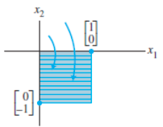 | $$\begin{bmatrix}1&0\\0&-1\end{bmatrix}$$ |
| Reflecting through the $$x_2$$-axis | 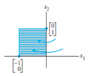 | $$\begin{bmatrix}-1&0\\0&1\end{bmatrix}$$ |
| Reflecting through the line $$x_2=x_1$$ | 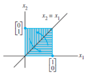 | $$\begin{bmatrix}0&1\\1&0\end{bmatrix}$$ |
| Reflecting through the line $$x_2=-x_1$$ | 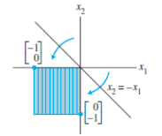 | $$\begin{bmatrix}0&-1\\-1&0\end{bmatrix}$$ |
| Reflecting through the origin | 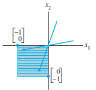 | $$\begin{bmatrix}-1&0\\0&-1\end{bmatrix}$$ |

### Table 2. Contractions and Expansions

| Transformation | Image of the Unit Square | Standard Matrix |
|----|----|----|
| Horizontal contraction and expansion | 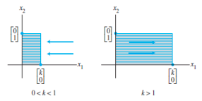 | $$\begin{bmatrix}k&0\\0&1\end{bmatrix}$$ |
| Vertical contraction and expansion | 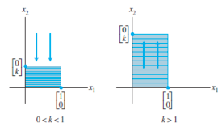 | $$\begin{bmatrix}1&0\\0&k\end{bmatrix}$$ |

### Table 3. Shears

| Transformation | Image of the Unit Square | Standard Matrix |
|----|----|----|
| Horizontal shear |  | $$\begin{bmatrix}1&k\\0&1\end{bmatrix}$$ |
| Vertical shear | 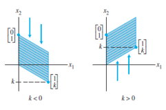 | $$\begin{bmatrix}1&0\\k&1\end{bmatrix}$$ |

### Table 4. Projections

| Transformation | Image of the Unit Square | Standard Matrix |
|----|----|----|
| Projection onto the $$x_1$$-axis | 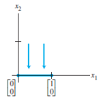 | $$\begin{bmatrix}1&0\\0&0\end{bmatrix}$$ |
| Projection onto the $$x_2$$-axis | 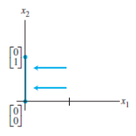 | $$\begin{bmatrix}0&0\\0&1\end{bmatrix}$$ |

---

## Definition : onto (전사)

A mapping $$T: \mathbb{R}^n \rightarrow \mathbb{R}^m$$ is said to be **onto(전사)** $$\mathbb{R}^m$$ if each $$\textbf{b}$$ in $$\mathbb{R}^m$$ is the image of at least one $$\textbf{x}$$ in $$\mathbb{R}^n$$.

* Equivalently, $$T$$ is onto $$\mathbb{R}^m$$ when the range of $$T$$ is all of the codomain $$\mathbb{R}^m$$. 
* That is, $$T$$ maps $$\mathbb{R}^n$$ onto $$\mathbb{R}^m$$ if, for each $$\textbf{b}$$ in the codomain $$\mathbb{R}^m$$, there exists at least one solution of $$T(\textbf{x})=\textbf{b}$$.
* **Dose $$T$$ map $$\mathbb{R}^n$$ $$\mathbb{R}^m$$ onto is an existence question. 
* The mapping $$T$$ is not onto when there is some $$\textbf{b}$$ in $$\mathbb{R}^m$$ for which the equation $$T(\textbf{x})=\textbf{b}$$ has no solution. 
* See the figure below.

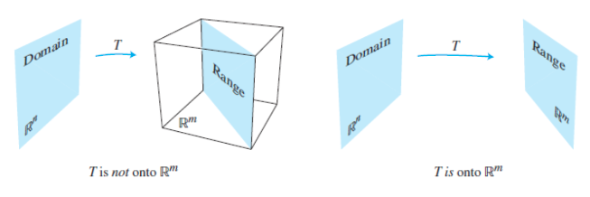

Figure 3. Is the range of $$T$$ all of $$\mathbb{R}^m$$?

---

## Definition : one-to-one

Definition: A mapping $$T: \mathbb{R}^n \rightarrow \mathbb{R}^m$$ is said to be **one-to-one(일대일)** if each $$\textbf{b}$$ in $$\mathbb{R}^m$$ is the image of at most one $$\textbf{x}$$ in $$\mathbb{R}^n$$.

>그림 추가

---

## Example 4: 

Let $$T$$ be the linear transformation whose standard matrix is 
$$$$
A=
\begin{bmatrix}
1 & -4 & 8 & 1 \\
1 & 2 & -1 & 3 \\
0 & 0 & 0 & 5 \\
\end{bmatrix}
$$$$

Does $$T$$ map $$\mathbb{R}^4$$ onto $$\mathbb{R}^3$$

Is $$T$$ a one-to-one mapping?

### Solution of Example 4:

Since $$A$$ happens to be in echelon form, we can see at once that $$A$$ has a pivot position in each row. **By Theorem 4 in Section 1.4**, for each $$\textbf{b}$$ in the equation $$A\textbf{x}=\textbf{b}$$ is consistent. In other words, the linear transformation $$T$$ maps $$\mathbb{R}^4$$(its domain) onto $$\mathbb{R}^3$$.

However, since the equation $$A\textbf{x}=\textbf{b}$$ has a free variable (because there are four variables and only three basic variables), each $$\textbf{b}$$ is the image of more than one $$\textbf{x}$$. This is, $$T$$ is not one-to-one. $$$$\blacksquare$$$$

---

## Theorem 11: 

Let $$T: \mathbb{R}^n \rightarrow \mathbb{R}^m$$ be a linear transformation.

Then $$T$$ is one-to-one if and only if the equation $$A\textbf{x}=\textbf{0}$$ has only the trivial solution.

### Proof of Theorem 11: 

Since T is linear, $$T(\textbf{0})=\textbf{0}$$. If $$T$$ is one-to-one, then the equation $$T(\textbf{x})=\textbf{0}$$ has at most one solution and hence only the trivial solution.

If $$T$$ is not one-to-one, then there is a $$\textbf{0}$$ that is the image of at least two different vectors in $$\mathbb{R}^n$$ --say, $$\textbf{u}$$ and $$\textbf{v}$$. That is $$T(\textbf{u})=\textbf{b}$$ and $$T(\textbf{v})=\textbf{b}$$. But then, since $$T$$ is linear,
$$$$
T(\textbf{u}-\textbf{v})=T(\textbf{u})-T(\textbf{v})=\textbf{b}-\textbf{b}=\textbf{0}
$$$$

The vector $$\textbf{u} − \textbf{u}$$ is not zero, since $$\textbf{u} \ne \textbf{u}$$. Hence the equation $$T(\textbf{x})=\textbf{0}$$ has more than one solution. So, either the two conditions in the theorem are both true or they are both false.

---

## Theorem 12: 

Let $$T: \mathbb{R}^n \rightarrow \mathbb{R}^m$$ be a linear transformation and let $$A$$ be the standard matrix for $$T$$. Then:

1. $$T$$ maps $$\mathbb{R}^n$$ onto $$\mathbb{R}^m$$ if and only if the columns of $$A$$ span $$\mathbb{R}^m$$;
2. $$T$$ is one-to-one if and only if the columns of $$A$$ are linearly independent.

### Proof of Theorem 12

**1.**

By Theorem 4 in Section 1.4, the columns of $$A$$ span if and only if for each $$\textbf{b}$$ in $$\mathbb{R}^m$$ the equation $$A\textbf{x}=\textbf{b}$$ is consistent—in other words, if and only if for every $$\textbf{b}$$,the equation $$T(\textbf{x})=\textbf{b}$$ has at least one solution. This is true if and only if $$T$$ maps $$\mathbb{R}^n$$ onto $$\mathbb{R}^m$$.

**2.**

The equations $$T(\textbf{x})=\textbf{0}$$ and $$A\textbf{x}=\textbf{0}$$ are the same except for notation. So, by Theorem 11, $$T$$ is one-to-one if and only if $$A\textbf{x}=\textbf{0}$$ has only the trivial solution. This happens if and only if the columns of A are linearly
independent.

---
