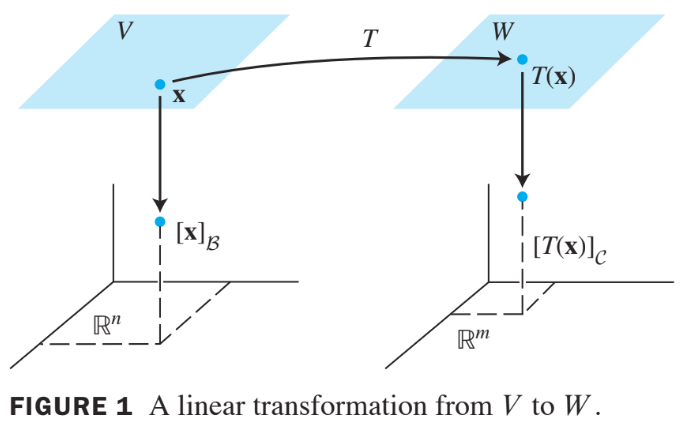
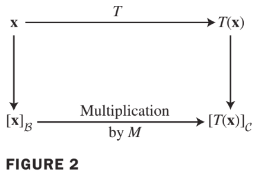
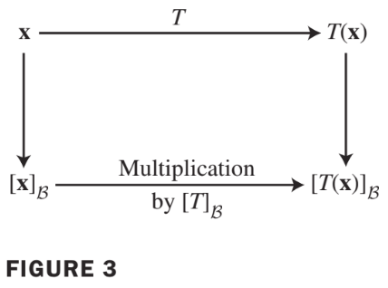

# Ch05. Eigenvalues and Eigenvectors

# 5.4 Eigenvectors and Linear Transformations

## The Matrix of a Linear Transformation

* Given any $$\textbf{x}$$ in $$\text{V}$$, the coordinate vector $$[\textbf{x}]_\mathcal{B}$$ is in $$\mathbb{R}^n$$ and the coordinate vector of its image, $$[T(\textbf{x})]_\mathcal{C}$$, is in $$\mathbb{R}^m$$, as shown in Fig. 1. below.

* The connection between $$[\textbf{x}]_\mathcal{B}$$ and $$[T(\textbf{x})]_\mathcal{C}$$ is easy to find.

* Let $$\left\{ \textbf{b}_1, \cdots , \textbf{b}_n \right\}$$ be the basis $$\mathcal{B}$$ for$$V$$. If $$\textbf{x}=r_1\textbf{b}_1+\cdots+r_n\textbf{b}_n$$ then, 
$$
[\textbf{x}]_\mathcal{B} = \begin{bmatrix}r_1 \\ \vdots \\ r_n \end{bmatrix}
$$

* And $$
T(\textbf{x}) = T(r_1\textbf{b}_1+\cdots+r_n\textbf{b}_n)=r_1T(\textbf{b}_1)+\cdots+r_nT(\textbf{b}_n) \tag{1}
$$ because $$T$$ is linear.

* Now, since the coordinate mapping from $$W$$ to $$\mathbb{R}^m$$ is linear, equation (1) leads to
$$
[T(\textbf{x})]_\mathcal{C} = r_1[T(\textbf{b}_1)]_\mathcal{C}+\cdots+r_n[T(\textbf{b}_n)]_\mathcal{C} \tag{2}
$$
* Since $$\mathcal{C}$$-coordinate vectors are in $$\mathbb{R}^m$$, the vector equation (2) can be written as a matrix equation, namely,
$$
[T(\textbf{x})]_\mathcal{C} = M [\textbf{x}]_\mathcal{B} \tag{3}
$$
where
$$
M = \begin{bmatrix} [T(\textbf{b}_1)]_\mathcal{C} & [T(\textbf{b}_2)]_\mathcal{C} & \cdots & [T(\textbf{b}_n)]_\mathcal{C} \end{bmatrix} \tag{4}
$$
* The matrix $$M$$ is a **matrix representation of $$T$$**, called the **matrix for $$T$$ relative to the bases $$\mathcal{B}$$ and $$C$$**. See Fig. 2 below:

> $$M$$ 이 실제로 coordinate vector를 linear transform하여 목표로하는 basis의 coordinate vector로 mapping

## Example 1

Suppose $$\mathcal{B}=\left\{\textbf{b}_1, \textbf{b}_2 \right\}$$ is a basis for $$V$$ and $$\mathcal{C}=\left\{\textbf{c}_1,\textbf{c}_2,\textbf{c}_3\right\}$$ is a basis for $$W$$. Let $$T: V \rightarrow W$$ be a linear transformation with the property that

$$
T(\textbf{b}_1)=3\textbf{c}_1-2\textbf{c}_2+5\textbf{c}_3
\text{ and }
T(\textbf{b}_2)=4\textbf{c}_1+ 7\textbf{c}_2-\textbf{c}_3
$$

Find the matrix $$M$$ for $$T$$ relative to $$\mathcal{B}$$ and $$\mathcal{C}$$.

### Solution

The $$C$$-coordinate vectors of the images of $$\textbf{b}_1$$ and $$\textbf{b}_2$$ are
$$
[T(\textbf{b}_1)]_\mathcal{C} = \begin{bmatrix} 3 \\ -2 \\ 5 \end{bmatrix} 
\text{ and } 
[T(\textbf{b}_2)]_\mathcal{C} = \begin{bmatrix} 4 \\ 7 \\ -1 \end{bmatrix}  
$$

* Hence
$$
M=\begin{bmatrix} 3 & 4 \\ -2 & 7 \\ 5 & -1 \end{bmatrix}
$$

If $$\mathcal{B}$$ and $$\mathcal{C}$$ are bases for the same space $$V$$ and if $$T$$ is the identity transformation $$T(\textbf{x})=\textbf{x}$$ for $$\textbf{x} \in V $$, then Matrix $$M$$ in (4) is **just a change-of-coordinates matrix**.

## Linear Transformations from V into V

* In the common case where $$W$$ is the same as $$V$$ and the basis $$\mathcal{C}$$ is the same as $$\mathcal{B}$$, the matrix $$M$$ in (4) is called **the matrix for $$T$$ relative to $$\mathcal{B}$$**, or simply the **$$\mathcal{B}$$-matrix for $$T$$**, and is denoted by $$[T]_\mathcal{B}$$.

## Example2

The mapping $$ T: \mathbb{P}_2 \rightarrow \mathbb{P}_2 $$ defined by 
$$
T(a_0+a_1t +a_2t^2) = a_1 +2a_2 t
$$
is a linear transformation.

1. Find the $$\mathcal{B}$$-matrix for $$T$$, when $$\mathcal{B}$$ is the basis $$\left\{ 1, t, t^2 \right\}$$
2. Verify that $$[T(\textbf{p})]_\mathcal{B} = [T]_\mathcal{B}[\textbf{p}]_\mathcal{B}$$

### Solution

1. Compute the images of the basis vectors:
$$
T(1) = 0 \\
T(t) = 1 \\
T(t^2) = 2t 
$$

* Then write the $$\mathcal{B}$$-coordinate vector of $$T(1), T(t)$$, and $$T(t^2)$$ and place them together as the $$\mathcal{B}$$-matrix for $$T$$:
$$
[T(1)]_\mathcal{B} = \begin{bmatrix}0 \\ 0 \\ 0 \end{bmatrix},
[T(t)]_\mathcal{B} = \begin{bmatrix}1 \\ 0 \\ 0 \end{bmatrix},
[T(t^2)]_\mathcal{B} = \begin{bmatrix}0 \\ 2 \\ 0 \end{bmatrix} \\
[T]_\mathcal{B} = \begin{bmatrix}0 & 1 & 0\\ 0& 0 &2 \\ 0& 0& 0 \end{bmatrix}
$$

2. For a general $$\textbf{p}(t)= a_0+a_1t+a_2t^2$$,
$$
\begin{align}
[T(\textbf{p})]_\mathcal{B}&=[a_1 + 2a_2 t]_\mathcal{B} = \begin{bmatrix} a_1 \\ 2a_2 \\ 0 \end{bmatrix}\\
&=\begin{bmatrix}0 & 1 & 0\\ 0& 0 &2 \\ 0& 0& 0 \end{bmatrix}\begin{bmatrix} a_0 \\ a_1 \\ a_2 \end{bmatrix} = [T]_\mathcal{B}[\textbf{p}]_\mathcal{B}
\end{align}
$$
* SeeFig. 4 below

## Linear Transformations on R to the n Power

## Theorem 8: 

Suppose $$A=PDP^{-1}$$ where $$D$$ is a diagonal $$n \times n$$ matrix. If $$\mathcal{B}$$ is the basis for $$\mathbb{R}^n$$ formed from the columns of $$P$$, then $$D$$ is the $$\mathcal{B}$$-matrix for the transformation $$\textbf{x} \mapsto A\textbf{x}$$.

### Proof

Denote the columns of $$P$$ by $$\textbf{b}_1,\cdots,\textbf{b}_n$$, so that $$\mathcal{B}=\left\{\textbf{b}_1,\cdots,\textbf{b}_n\right\}$$ and $$P=\begin{bmatrix}\textbf{b}_1 \cdots \textbf{b}_n\end{bmatrix}$$. In this case, $$P$$ is the change-of-coordinates matrix $$P_\mathcal{B}$$ discussed in Section 4.4, where

$$
P[\textbf{x}]_\mathcal{B}=\textbf{x} \text{ and } [\textbf{x}]_\mathcal{B} = P^{-1} \textbf{x}
$$

If $$T(\textbf{x})=A\textbf{x}$$ for $$\textbf{x} \in \mathbb{R}^n$$, then 

Since $$A=PDP^{-1}$$, we have $$[T]_\mathcal{B} = P^{-1}AP = D$$.

## Example3

### Solution
