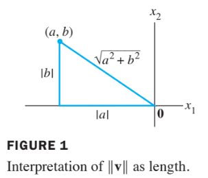
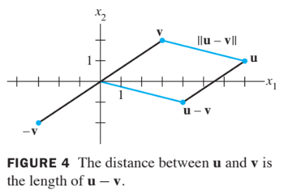
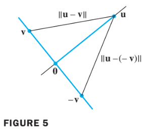
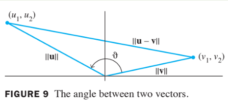

# Orthogonality and Least Square

# 6.1 Inner Product, Length, and Orthogonality

## Inner Prodcut

If $$\textbf{u}$$ and  $$\textbf{v}$$ are vector in $$\mathbb{b}$$,
then we regard $$\textbf{u}$$ and $$\textbf{v}$$ as $$n \times 1$$ matrices.

The transpose $$\textbf{u}^T$$ is a $$1 \times n$$ matrix, and the matrix product $$\textbf{u}^T\textbf{v}$$ is an $$1 \times 1$$ matrix, which we write as a single real number (a scalar) without brackets.

The number $$\textbf{u}^T\textbf{v}$$ is called the **inner product** of $$\textbf{u}$$ and $$\textbf{v}$$, and it is written as $$\textbf{u} \cdot \text{v}$$.

This inner product is also referred to as a dot product

If $$\textbf{u}=\begin{bmatrix} u_1 \\ u_2 \\ \vdots \\ u_n \end{bmatrix}$$ and $$\textbf{v}=\begin{bmatrix} v_1 \\ v_2 \\ \vdots \\v_n \end{bmatrix}$$,

then the inner product of $$\textbf{u}$$ and $$\textbf{v}$$ is 

$$
\begin{bmatrix} u_1 & u_2 & \cdots * & u_n\end{bmatrix} 
\begin{bmatrix} v_1 \\ v_2 & \vdots * \\ v_n\end{bmatrix} = 
u_1 v_1 + u_2 v_2 + \cdots + u_n v_n.
$$

---

## Theorem 1

Let $$\bf{u},\bf{v}$$, and $$\textbf{v}$$ be vectors in $$\mathbb{R}^n$$, and let $$c$$ be a scalar. Then

1. $$\textbf{u} \cdot \textbf{v} = \textbf{v} \cdot \textbf{u}$$
2. $$(\textbf{u} + \textbf{v})\cdot \textbf{w} = \textbf{u}\cdot \textbf{w} + \textbf{v}\cdot \textbf{w}$$
3. $$(c \textbf{u})\cdot \textbf{v} = c (\textbf{u}\cdot \textbf{v} )= \textbf{u}\cdot (c \textbf{v} )$$
4. $$\textbf{u}\cdot\textbf{u} \ge 0$$, and $$\textbf{u}\cdot\textbf{u} = 0$$ if and only if $$\textbf{u} = 0$$

Properties (2) and (3) can be combined several times to produce the following useful rule:

$$
(c_1 \bf{u}_1  +\cdots +c_p \bf{u}_p) \cdot \bf{w} = c_1 (\bf{u}_1 \cdot \bf{w}) + \cdots + c_p (\bf{u}_p \cdot \bf{w})
$$

---

## The Length of a Vector

If $$\bf{v}$$ is in $$\mathbb{R}^n$$, with entries $$\bf{v}_1,\cdots, \bf{v}_n$$, then the square root of $$\bf{v}\cdot \bf{v}$$ is defined because  $$\bf{v}\cdot \bf{v}$$ is nonengative.

## Definition of Length

The length (or **norm**) of $$\bf{v}$$ is the nonnegative scalar $$\lVert \bf{v} \rVert$$ defined by

$$
\lVert \bf{v} \rVert = \sqrt{(\bf{v}\cdot \bf{v}} = \sqrt{(v_1^2 +v_2^2 + \cdots +v_n^2)}
$$,
and $$\lVert \bf{v} \rVert ^2 = \bf{v}\cdot \bf{v}$$

Suppose $$\bf{v}$$ is in $$\mathbb{R}^2$$, say $$\bf{v}=\begin{bmatrix}a \\ b \end{bmatrix}$$

If we identify $$\lVert \bf{v} \rVert$$ with a geometric point in the plane, 
as usual, then $$\lvert \bf{v} \rVert$$ coincides with 
the standard notion of the length of the line segment of from the origin to $$\bf{v}$$.

This follows from the **Pythagorean Theorem** applied to a triangle 
such as the one shown in the following figure.

For any scalar $$c$$, the length $$c\bf{v}$$ is $$|c|$$ times the length of $$\bf{v}$$. That is

$$
\lVert c \bf{v} \rVert = |c| \lVert \bf{v} \rVert
$$

A vector whose length is 1 is called a **unit vector**.

If we divide a nonzero vector $$\bf{v}$$ by its length—that is, 
multiply by $$\frac{1}{\lVert \bf{v} \rVert}$$ 
—we obtain a unit vector $$\bf{u}$$ because the length of $$\bf{u}$$ is $$\frac{1}{\lVert \bf{v} \rVert}\lVert \bf{v} \rVert$$.
The process of creating $$\bf{u}$$, from $$\bf{v}$$ is sometimes
called **normalizing** $$\bf{v}$$, and we say that $$\bf{u}$$, is in the
same direction as $$\bf{v}$$.

## Example 2:

Let $$ \bf{v}=(1,-2,2,0)$$. Find a unit vector $$\bf{u}$$ in the same direction as $$\bf{v}$$.

### Solution:

First, compute the length of $$\bf{v}$$:

$$
\lVert \bf{v} \rVert^2 = \bf{v} \cdot \bf{v} = (1)^2 + (-2)^2 +(2)^2 +(0)^2 = 9 \\
\lVert \bf{v} \rVert = \sqrt{9} = 3
$$

Then, multiply $$\bf{v}$$ by $$\frac{1}{\lVert \bf{v} \rVert}$$ to obtain

$$
\begin{align*}
\bf{u} &= \frac{1}{\lVert \bf{v} \rVert} \bf{v} \\
&= \frac{1}{3}\bf{v} \\
&= \frac{1}{3}\begin{bmatrix}1 \\ -2 \\ 2 \\ 0 \end{bmatrix} \\
&= \begin{bmatrix} 1/3 \\ -2/3 \\ 2/3 \\ 0 \end{bmatrix}
\end{align*}
$$

## Distance in R to the $$n$$ Power

## Definintion of Distance

For $$\bf{u}$$ and $$\bf{v}$$ in $$\mathbb{R}^n$$, the **distance between $$\bf{u}$$ and $$\bf{v}$$**, written as $$\text{dist}(\bf{u},\bf{v})$$, is the length of the vector $$\bf{u} - \bf{v}$$. That is 

$$
\text{dist}(\bf{u},\bf{v}) = \lVert \bf{u}-\bf{v} \rVert
$$

## Example 4:

Compute the distance between the vectors $$\bf{u}=(7,1)$$ and $$\bf{v}=(3,2)$$.

### Solution of Example 4

Calculate 

$$
\begin{align*}
\bf{u}-\bf{v} &= \begin{bmatrix}7 \\ 1\end{bmatrix}-\begin{bmatrix}3 \\ 2\end{bmatrix}=\begin{bmatrix}4 \\ -1\end{bmatrix}\\
\lVert \bf{u}-\bf{v} \rVert &= \sqrt{4^2+(-1)^2} = \sqrt{17}
\end{align*}
$$

The vectors $$\bf{u}$$,$$\bf{v}$$, and $$\bf{u}-\bf{v}$$ are shown in the figure below.

When the vector $$\bf{u}-\bf{v}$$  is added to $$\bf{v}$$, the result is $$\bf{u}$$.

Notice that the parallelogram in the above figure 
shows that the distance from $$\bf{u}$$ to $$\bf{v}$$ is the same as 
the distance from $$\bf{u}−\bf{v}$$ to $$\bf{0}$$.

## Orthogonal Vectors

Consider $$\mathbb{R}^2$$ or $$\mathbb{R}^3$$ and two lines through the origin dertermined by vectors $$\bf{u}$$ and $$\bf{v}$$.

See the figure below. The two lines shown in the figure below are geomatrically perpendicular if and only if the distance from $$\bf{u}$$ to $$\bf{v}$$ is the same as the distance from $$\bf{u}$$ to $$-\bf{v}$$.

This is the same are requiring the squares fo the distances to be the same.

Now

$$
\begin{align*}
[\text{dist}(\bf{u},\bf{-v})]^2 &= \lVert \bf{u}-(-\bf{v}) \rVert ^2 = \lVert \bf{u}+\bf{v} \rVert ^2 \\
&=(\bf{u}+\bf{v})\cdot (\bf{u}+\bf{v}) \\
&=\bf{u}\cdot (\bf{u}+\bf{v})+ \bf{v}\cdot (\bf{u}+\bf{v}) & \text{Theorem 1 (2)} \\
&=\bf{u}\cdot \bf{u}+ \bf{u}\cdot \bf{v})+ \bf{v}\cdot \bf{u}+\bf{v} \cdot \bf{v} & \text{Theorem 1 (1),(2)} \\
&=\lVert \bf{u} \rVert ^2 + \lVert \bf{v} \rVert ^2 + 2\bf{u}\cdot \bf{v} & \text{Theorem 1 (1)} 
\end{align*}
$$

The same calculations with $$\bf{v}$$ and $$\bf{−v}$$ interchanged show that

$$
\begin{align*}
[\text{dist}(\bf{u},\bf{v})]^2 &= \lVert \bf{u} \rVert ^2 + \lVert \bf{-v} \rVert ^2 +2\bf{u}\cdot (\bf{-v}) \\
&=\lVert \bf{u} \rVert ^2 +\lVert \bf{-v} \rVert ^2 -2\bf{u}\cdot \bf{v} 
\end{align*}
$$

The two squared distances are equal if and only if $$2\bf{u}\cdot\bf{v}=-2\bf{u}\cdot\bf{v}$$, which happens if and only if 
$$ \bf{u} \cdot \bf{v} = 0$$.

This calculation shows that when vectors $$\bf{u}$$ and $$\bf{v}$$ are
identified with geometric points, 
the corresponding lines through the points and the origin are 
perpendicular if and only if  $$ \bf{u} \cdot \bf{v} = 0$$.

---
## Definitio of Orthogonality

Two vectors $$\bf{u}$$ and $$\bf{v}$$ in $$\mathbb{R}^n$$ are **orthogonal** (to each other) if $$\bf{u}\cdot\bf{v}= 0$$.

---

The zero vector is orthgonal to every vectors in $$\mathbb{R}^n$$ becuase $$\bf{0}^T \bf{v} = 0$$ for all $$\bf{v}$$.

---
## Theorem 2

Two vectors $$\bf{u}$$ and $$\bf{v}$$ are orthogonal if and only if $$ \lVert \bf{u}+\bf{v} \rVert^2 = \lVert \bf{u} \rVert ^2 + \lVert \bf{v} \rVert ^2$$.

---

## Orthogonal Complements

If a vector $$\bf{z}$$ is orthogonal to every vector in a subspace $$W$$ of $$\mathbb{R}^n$$, 
then $$\bf{z}$$ is said to be **orthogonal to** $$W$$.

The set of all vectors $$\bf{z}$$ that are orthogonal to $$W$$ is 
called the orthogonal complement** of $$W$$ and is denoted by $$W^{\perp}$$ (and read as “W perpendicular” or simply “W perp”).

1. A vector $$\bf{x}$$ is in $$W^{\perp}$$ if and only if $$\bf{x}$$ is orthogonal to every vector in a set that spans $$W$$.
2. $$W^{\perp}$$ is a subspace of $$\mathbb{R}^n$$

---
## Theorem 3

Let $$A$$ be an $$m \times n$$ matrix. 
The orthogonal complement of the row space of $$A$$ is 
the null space of $$A$$, and 
the orthogonal complement of the column space of $$A$$ is the null space of $$A^{T}$$:

$$
(\text{Row }A)^{\perp} = \text{Nul }A \\
(\text{Col }A)^{\perp} = \text{Nul }A^T
$$

### Proof: 

The row-column rule for computing $$A\bf{x}$$ shows that if $$\bf{x}$$ is in $$\text{Nul }A$$, then $$\bf{x}$$ is orthogonal to 
each row of $$A$$ (with the rows treated as vectors in $$\mathbb{R}^n$$).

Since the rows of $$A$$ span the row space, $$\bf{x}$$ is orthogonal to $$\text{Row }A$$.

Conversely, if $$\bf{x}$$ is orthogonal to $$\text{Row }A$$, 
then $$\bf{x}$$ is certainly orthogonal to each row of $$A$$, 
and hence $$A\bf{x}=\bf{0}$$

This proves the first statement of the theorem.

Since this statement is true for any matrix, it is true for $$A^T$$.

That is, the orthogonal complement of the row space of $$A^T$$ 
is the null space of $$A^T$$

This proves the second statement, because

## Angles In R Squared and R Cubed (Optional)

If $$\bf{u}$$ and $$\bf{v}$$ are nonzero vectors in either

then there is a nice connection between their inner
product and the angle θ between the two line
segments from the origin to the points identified
with $$\bf{u}$$ and $$\bf{v}$$.

The formula is

$$
\bf{ur} \cdot \bf{v} = \lVert \bf{u} \rVert \lVert \bf{v} \rVert \cos{\theta} \tag{2}
$$

To verify this formula for vectors in $$\mathbb{R}^n$$, consider the 
triangle shown in the figure below with sides of lengths, 
$$\lVert \bf{u} \rVert$$,$$ \lVert \bf{v} \rVert$$, and $$ \lVert \bf{u}-\bf{v} \rVert$$.

By the law of cosines,

$$
\lVert \bf{u}-\bf{v} \rVert ^2 = \lVert \bf{u} \rVert ^2 + \lVert \bf{v} \rVert ^2 - 2 \lVert \bf{u} \rVert \lVert \bf{v} \rVert
\cos{\theta}
$$

which can be rearranged to produce the equations below

$$
\begin{align*}
\end{align*}
$$

The verification for $$\mathbb{R}^n$$ is similar.

When $$n > 3$$, formula (2) may be used to define the angle between two vectors in $$\mathbb{R}^n$$.

In statistics, the value of $$\cos{\theta}$$ defined by (2) for suitable vectors $$\bf{u}$$ and $$\bf{v}$$ is called a correlation coefficient.
